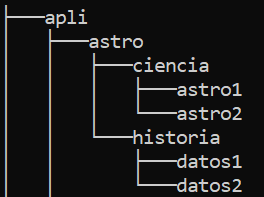

## Ejercicio 3
#### 1. Borra la carpeta ACCESS y en su lugar crea una nueva carpeta llamada ASTRO
```

```
#### 2. Crea la siguiente estructura de subcarpetas dentro de la carpeta ASTRO


#### 3. Situate en la carpeta CIENCIA y desde allí mostrar el listado de archivos y subcarpetas de la carpeta HISTORIA(usa tree)
```

```
#### 4. Utilizando el ``notepad`` crea un archivo de texto y guardalo con el nombre TYCHO.TXT dentro de la carpeta DATOS1
```

```
#### 5. Utilizando de nuevo el ``notepad`` un archivo de texto, y guurdalo con el nombre KEPLER.TXT dentro de la carpeta DATOS2
```

```
#### 6. Copia los archivos TYCHO.TXT y KEPLER.TXT en la carpeta CIENCIA
```

```
#### 7. Cambia de lugar los archivos almacenados en DATOS1 y DATOS2 de forma que TYCHO.TXT quede guardado dentro DATOS2 y KEPLER.TXT en DATOS1
```

```
#### 8. Crea un nuevo archivo formado por la unión de los dos anteriores (sin volver a escribir el texto) y guardalo dentro de la carpeta HISTORIA con el nombre TOTAL.TXT (usa comodines para referenciar a los dos archivos ``*.txt``)
```

```
#### 9. Abri el archivo KEPLER.TXT almacenado en la carpeta CIENCIA y añadi el siguiente texto (``cualquier texto``)
```

```
#### 10. Cambia el nombre del archivo anterior por el de GALILEO.TXT
```

```